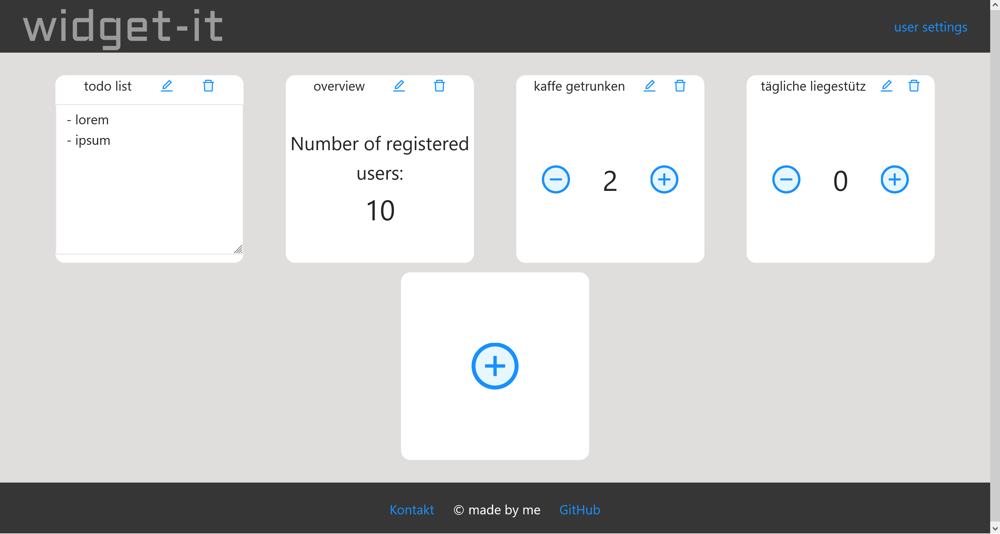

# widget-it

Your new browser starting page!

Customize your browser starting page with widgets and be directly up to date as well as manage your daily tasks.


 
## set-up
in basic-frontend/
```commandline
npm install
npm run-script build
```

in basic-backend/
```commandline
npm install
npm run-script start
```

